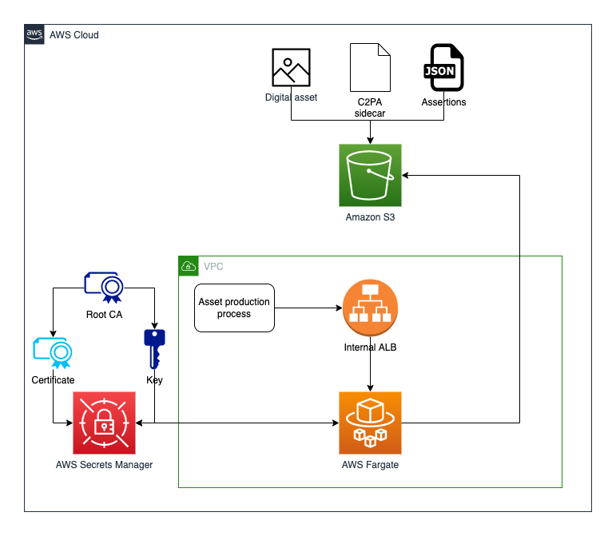
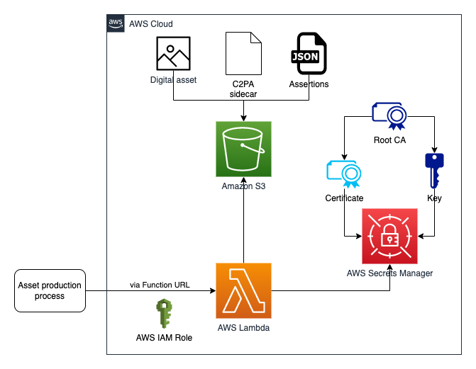

# Running C2PA Workloads on AWS Fargate and AWS Lambda

## Coalition for Content Provenance and Authenticity (C2PA)

Tracking content provenance has always been a challenge for media companies. With the advent of generative artificial intelligence (Gen AI), it has become increasingly important for providers and creators in the media and entertainment space to record the provenance of assets throughout the content production and distribution process. These records are critical for three reasons:

- Ensure content production and distribution is consistent with rights.
- Track ownership of content so that it can be properly stored and monetized.
- Attest to the authenticity of content to combat the spread of false news and appropriately label assets created by Gen AI to maintain public trust.

The Coalition for Content Provenance and Authenticity (C2PA) has developed a new standard for tracking provenance that is gaining traction in the media industry. The C2PA standard provides a mechanism for creating digitally signed manifests that can be attached to assets. These manifests serve as a credential of authenticity and make it possible to determine the source of assets found online.

This project showcases how to run C2PA workloads on AWS. Two architectural options are available for this purpose. Both options utilize an open-source C2PA command-line tool developed by the Content Authority Initiative (CAI). The tool accepts a digital asset along with input arguments to produce a C2PA sidecar file. Both architectures wrap the command-line tool within a Docker container and expose its functionality via REST APIs.

## AWS Fargate Option



The diagram above shows the C2PA workload option of hosting on Amazon’s container-based service AWS Fargate. This service allows users to run serverless compute for containers. The container itself is Python-based and operates a web-like server on the FastAPI framework.

Tucked behind an internal-facing Application Load Balancer (ALB), the container is only accessible to callers from within the Amazon Virtual Private Cloud (VPC) in which it was launched, or any VPC with a peering connection. When processing C2PA requests, the container has access to a digital certificate and private key stored in AWS Secrets Manager.

> If the Application Load Balancer is set to be public-facing, it is strongly recommended that appropriate API protections be applied to the API. By default, the ALB is internal-facing, and the FastAPI does not have configured authentication or TLS. Please refer to [this documentation](https://docs.aws.amazon.com/elasticloadbalancing/latest/application/listener-authenticate-users.html) to get started on configuring authentication for the Application Load Balancer.

## AWS Lambda Option



The diagram above shows the architecture based on AWS Lambda. This approach leverages AWS Lambda’s ability to run Docker containers. The launched container is Python-based and operates a web-like server on the FastAPI framework.

AWS Lambda is capable of exposing itself as an API without the need for additional AWS services via AWS Lambda Function URLs. The endpoint is protected by AWS Identity and Access Management (IAM) authorization, which is typically inherited by the caller’s AWS IAM Role Permissions. AWS Secrets Manager is used to provide the AWS Lambda function with the necessary certificate and private key to process the request.

> After deploying the project, in order to successfully invoke the AWS Lambda Function via Function URLs, the caller must have the necessary permissions to invoke the Function URL. The role of the user should have the `lambda:InvokeFunctionUrl` action granted to allow the user to invoke the function. To learn more, please check out [this documentation](https://docs.aws.amazon.com/lambda/latest/dg/urls-auth.html).

## 0. Pre-requisites

The AWS Cloud Development Kit (CDK) is an open-source software development framework that allows you to define and provision cloud infrastructure resources using familiar programming languages, such as TypeScript, JavaScript, Python, Java, and C#. It provides a higher-level abstraction over the low-level AWS CloudFormation templates, making it easier to model and provision cloud resources in a more programmatic and maintainable way.

This project leverages the CDK to seamlessly deploy the infrastructure to your AWS account. To utilize the CDK, you need to have the following installed:

- [Node.js](https://nodejs.org/en) and npm v20+.
- [Docker](https://www.docker.com/products/docker-desktop/)
- [AWS CDK](https://docs.aws.amazon.com/cdk/v2/guide/getting_started.html#getting_started_install)
- [AWS CLI](https://docs.aws.amazon.com/cli/latest/userguide/getting-started-install.html)

To successfully connect the AWS CLI to your AWS account, you'll need to configure your terminal session using one of the following methods:

- [aws configure](https://docs.aws.amazon.com/cli/latest/userguide/cli-chap-configure.html)
- [AWS Environment Variables](https://docs.aws.amazon.com/cli/latest/userguide/cli-configure-envvars.html)
- [aws sso login](https://docs.aws.amazon.com/cli/latest/userguide/cli-configure-sso.html)

## 1. Install the required packages

```sh
npm install
```

## 2. Import Certificate & Private Key

Navigate to `lib/public_creds/README.md` and follow the instructions.

## 3. Bootstrap your AWS Account

Bootstrapping is the process of preparing an environment for deployment. Bootstrapping is a one-time action that you must perform for every environment that you deploy resources into.

```sh
cdk bootstrap
```

## 4. Deployment

Deploy the prototype using:

```sh
cdk deploy
```

The cdk outputs cloudformation templates to the `cdk.out` folder. By running the following command you will be able to access these templates at `C2PaStack.template.json`

The project will synthesize and then deploy

> Deploying this project will provision resources in your account, which may incur charges.

## 4.1 Clean Up

This sample code is deployed using a CloudFormation template, which makes the cleanup process straightforward. To delete the CloudFormation stack and remove all assets created when the resources were deployed into your account, you can execute the following command from the root folder of the CDK project:

```sh
cdk destroy
```

This command will initiate the process of deleting the CloudFormation stack and its associated resources, effectively cleaning up your account.

## 5. Endpoint parameters

> For testing the endpoint, we recommend provisioning an AWS Cloud9 instance. AWS Cloud9 is a cloud-based integrated development environment (IDE) that allows you to write, run, and debug your code directly from a web browser. During the provisioning process, you'll have the option to select the Virtual Private Cloud (VPC) where the Application Load Balancer (ALB) was deployed as part of this project's deployment. This setup will grant your AWS Cloud9 instance the ability to successfully invoke the internal-facing ALB.

This project has 2 endpoints:

- ALB + Fargate
  - Internal Load Balancer
- Lambda Function URL
  - IAM AUTH

Both endpoint have configured 3 API routes:

> The 'x' placeholders shown below represent dynamic variables that you will need to replace with the appropriate values. For instance, when you provision your Application Load Balancer (ALB), it will be assigned a unique name, and you should substitute the 'x' placeholders with this specific name.

1.  **/** (GET request)

    - Route is used as a HEALTHCHECK to verify the endpoint works. It does not accept parameters, and is a simple GET request.

      Here's an example of how to invoke each endpoint:

    - #### ALB + Fargate:

      ```sh
      curl xxx-alb_endpoint-xxx/
      ```

      > Must be invoked from the VPC the ALB is launched in or a peered VPC

    - #### Lambda Function URL:

      > awscurl is a command-line tool that allows users to send HTTP requests to AWS API with AWS Signature Version 4 request signing. You can use pip to install awscurl. `pip install awscurl`

      ```sh
      awscurl --service lambda "xxx-function_url_endpoint-xxx/" --region xxxx
      ```

2.  **/c2pa** (POST request)

    - This route processes your request and returns a pre-signed URL for downloading a .c2pa sidecar file.
    - The body of the request accepts the following parameters:

      ```js
      presigned_asset_url: Required. The presigned URL of the photo/video asset.

      assertions_json: Optional. This option allows you to paste the JSON payload for assertions directly into the curl request.

      presigned_assertions_json: Optional. This option allows you to paste the presigned URL to an assertions JSON file instead of pasting the JSON payload directly in the curl request.

      presigned_parent_c2pa: Optional. If you choose to incorporate a parent .c2pa file, use this parameter. This should be the presigned link of the parent .c2pa file, which will be included as an ingredient in the output sidecar.
      ```

      > A presigned URL is a temporary URL that provides secure access to an Amazon S3 bucket or object without exposing your AWS credentials. It allows you to grant time-limited permissions to upload or download specific objects from your private S3 resources, without making them publicly accessible. Presigned URLs are commonly used to securely share S3 resources with others or enable third-party applications to access your S3 resources without managing IAM credentials directly.

      Here's an example of how you would invoke each endpoint

    - #### ALB+Fargate:

      ```sh
      curl -d '{"presigned_asset_url":"REPLACE","assertions_json":{REPLACE}}' \
      -H "Content-Type: application/json" \
      xxx-alb_endpoint-xxx/c2pa
      ```

      > Must be invoked from the VPC the ALB is launched in or a peered VPC

    - #### Lambda Function URL:

      ```sh
      awscurl --service lambda \
      -X POST \
      -d '{"presigned_asset_url":"REPLACE","assertions_json":{REPLACE}}' \
      "xxx-function_url_endpoint-xxx/c2pa" \
      --region xxxx
      ```

3.  **/read_c2pa** (POST request)

    - This route is used to read into JSON format the contents of the .c2pa file.
    - The parameters it accepts in the body are:

      ```js
      return_type: Required. Either 'json' or 'presigned_url'

      presigned_c2pa_url: Required. The .c2pa file you wish to convert into json.
      ```

      Here's an example of how you would invoke each endpoint

    - #### ALB+Fargate:

      ```sh
      curl -d '{"return_type":"REPLACE","presigned_c2pa_url":"REPLACE"}' \
      -H "Content-Type: application/json" \
      xxx-alb_endpoint-xxx/read_c2pa
      ```

      > Must be invoked from the VPC the ALB is launched in or a peered VPC

    - #### Lambda Function URL:

      ```sh
      awscurl --service lambda \
      -X POST \
      -d '{"return_type":"REPLACE","presigned_c2pa_url":"REPLACE"}' \
      "xxx-function_url_endpoint-xxx/c2pa" \
      --region xxxx
      ```

## Troubleshooting

- If you encounter issues during deployment, try deleting the `cdk.out` folder and redeploy the application. The `cdk.out` folder is where the AWS Cloud Development Kit (CDK) synthesizes and outputs the AWS CloudFormation templates, which are subsequently deployed to your AWS account. By deleting this folder, you force the CDK to regenerate the CloudFormation templates, potentially resolving any underlying issues caused by outdated or corrupted templates in the `cdk.out` folder.

- If you encounter a token error during deployment, it likely indicates that your terminal session is not properly authenticated with your AWS account. To resolve this, verify your AWS credentials, renew your AWS session if expired, ensure you are targeting the correct AWS region, and check that your IAM user or role has the necessary permissions for deployment operations.

- If you continue to face deployment issues, you can consider destroying the existing CloudFormation stack and redeploying the application from scratch. This approach ensures a clean slate, eliminating potential conflicts or inconsistencies caused by the previous deployment. However, be cautious as destroying the stack will remove all associated resources, including any data stored in those resources, so it's crucial to back up important data beforehand.

## Security

See [CONTRIBUTING](CONTRIBUTING.md#security-issue-notifications) for more information.

## License

This library is licensed under the MIT-0 License. See the LICENSE file.
