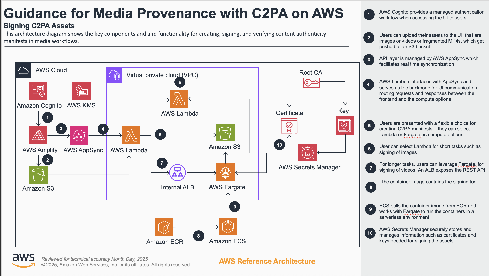

# Running C2PA Workloads on AWS Fargate and AWS Lambda

## Coalition for Content Provenance and Authenticity (C2PA)

Tracking content provenance has always been a challenge for media companies. With the advent of generative artificial intelligence (Gen AI), it has become increasingly important for providers and creators in the media and entertainment space to record the provenance of assets throughout the content production and distribution process. These records are critical for three reasons:

- Ensure content production and distribution is consistent with rights.
- Track ownership of content so that it can be properly stored and monetized.
- Attest to the authenticity of content to combat the spread of false news and appropriately label assets created by Gen AI to maintain public trust.

The Coalition for Content Provenance and Authenticity (C2PA) has developed a new standard for tracking provenance that is gaining traction in the media industry. The C2PA standard provides a mechanism for creating digitally signed manifests that can be attached to assets. These manifests serve as a credential of authenticity and make it possible to determine the source of assets found online.

This project showcases how to run C2PA workloads on AWS. Two architectural options are available for this purpose. Both options utilize an open-source C2PA command-line tool developed by the Content Authority Initiative (CAI). The tool accepts a digital asset along with input arguments to produce a C2PA sidecar file. Both architectures wrap the command-line tool within a Docker container and expose its functionality via REST APIs.



## 0. Pre-requisites

The AWS Cloud Development Kit (CDK) is an open-source software development framework that allows you to define and provision cloud infrastructure resources using familiar programming languages, such as TypeScript, JavaScript, Python, Java, and C#. It provides a higher-level abstraction over the low-level AWS CloudFormation templates, making it easier to model and provision cloud resources in a more programmatic and maintainable way.

This project leverages the CDK to seamlessly deploy the infrastructure to your AWS account. To utilize the CDK, you need to have the following installed:

- [Node.js](https://nodejs.org/)
- [Docker](https://www.docker.com/)
- [AWS CLI](https://aws.amazon.com/cli/)
- [AWS CDK CLI](https://docs.aws.amazon.com/cdk/v2/guide/cli.html)
- [pnpm](https://pnpm.io/installation)

To successfully connect the AWS CLI to your AWS account, you'll need to configure your terminal session using one of the following methods:

- [aws configure](https://docs.aws.amazon.com/cli/latest/userguide/cli-chap-configure.html)
- [AWS Environment Variables](https://docs.aws.amazon.com/cli/latest/userguide/cli-configure-envvars.html)
- [aws sso login](https://docs.aws.amazon.com/cli/latest/userguide/cli-configure-sso.html)

## 1. Install the required packages

```sh
pnpm install
```

## 2. Import Certificate & Private Key

Navigate to [packages/infra/lib/NestedStacks/C2pa/SecretsManager/README.md](packages/infra/lib/NestedStacks/C2pa/SecretsManager/README.md) and follow the instructions.

## 3. Bootstrap your AWS Account

Bootstrapping is the process of preparing an environment for deployment. Bootstrapping is a one-time action that you must perform for every environment that you deploy resources into.

```sh
pnpm cdk bootstrap
```

## 4. Deployment

Deploy the guidance using:

```sh
pnpm cdk deploy
```

The cdk outputs cloudformation templates to the `cdk.out` folder. By running the following command you will be able to access these templates at `C2PaStack.template.json`

The project will synthesize and then deploy

> Deploying this project will provision resources in your account, which may incur charges.

## 5. User Login

After deploying the guidance, you'll need to create a new user in the Cognito user pool. This pool is typically named "C2paStack" and can be found in the AWS Console.

The user you create here will serve as your login profile for the web application. You'll use an email address and password to set up this account, which you'll then use to access the application.

## 5.1. Locally Test WebApp (Optional)

Congratulations on reaching this stage! You've successfully deployed the guidance and can now log into the deployed web application. To find the link, navigate to the Amplify service in your AWS Console. This next step will guide you through locally testing the webapp while connecting to the deployed resources.

First, create a new .env file in the packages/webapp directory. In this file, you'll need to add the variable outputs from your CDK deployment. Specifically, include all variables that start with "VITE".

There are two ways to retrieve these variables:

1. Check the CLI output after deployment. Look for blue text at the very end - these are the output variables.
2. Navigate to the CloudFormation console, select your stack, and click on the "Outputs" tab.

Once you've copied the variables to your .env file, add an underscore after "VITE" for each variable. Your .env file should look similar to this:

```
VITE_APPSYNCAPI = xxxxxxxxx
VITE_FRONTENDSTORAGEBUCKET = xxxxxxxxx
VITE_IDENTITYPOOLID = xxxxxxxxx
VITE_REGION = xxxxxxxxx
VITE_USERPOOLCLIENTID = xxxxxxxxx
VITE_USERPOOLID = xxxxxxxxx
VITE_CLOUDFRONTURL = xxx
```

Replace the X's with your actual resource values. This setup will allow you to test the webapp locally while connecting to your deployed AWS resources.

Once you've configured your application locally, you can run a localhost copy of your web application. To do this, run the following:

```
pnpm dev
```

## 6. Clean Up

This sample code is deployed using a CloudFormation template, which makes the cleanup process straightforward. To delete the CloudFormation stack and remove all assets created when the resources were deployed into your account, you can execute the following command from the root folder of the CDK project:

```sh
pnpm cdk destroy
```

This command will initiate the process of deleting the CloudFormation stack and its associated resources, effectively cleaning up your account.

## Commands

Have a look at the `package.json` under the scripts section these would be high level commands you can run to operate this repository.

## Troubleshooting

- If you encounter issues during deployment, try deleting the `cdk.out` folder and redeploy the application. The `cdk.out` folder is where the AWS Cloud Development Kit (CDK) synthesizes and outputs the AWS CloudFormation templates, which are subsequently deployed to your AWS account. By deleting this folder, you force the CDK to regenerate the CloudFormation templates, potentially resolving any underlying issues caused by outdated or corrupted templates in the `cdk.out` folder.

- If you encounter a token error during deployment, it likely indicates that your terminal session is not properly authenticated with your AWS account. To resolve this, verify your AWS credentials, renew your AWS session if expired, ensure you are targeting the correct AWS region, and check that your IAM user or role has the necessary permissions for deployment operations.

- If you continue to face deployment issues, you can consider destroying the existing CloudFormation stack and redeploying the application from scratch. This approach ensures a clean slate, eliminating potential conflicts or inconsistencies caused by the previous deployment. However, be cautious as destroying the stack will remove all associated resources, including any data stored in those resources, so it's crucial to back up important data beforehand.

## Security

See [CONTRIBUTING](CONTRIBUTING.md#security-issue-notifications) for more information.

## License

This library is licensed under the MIT-0 License. See the LICENSE file.
